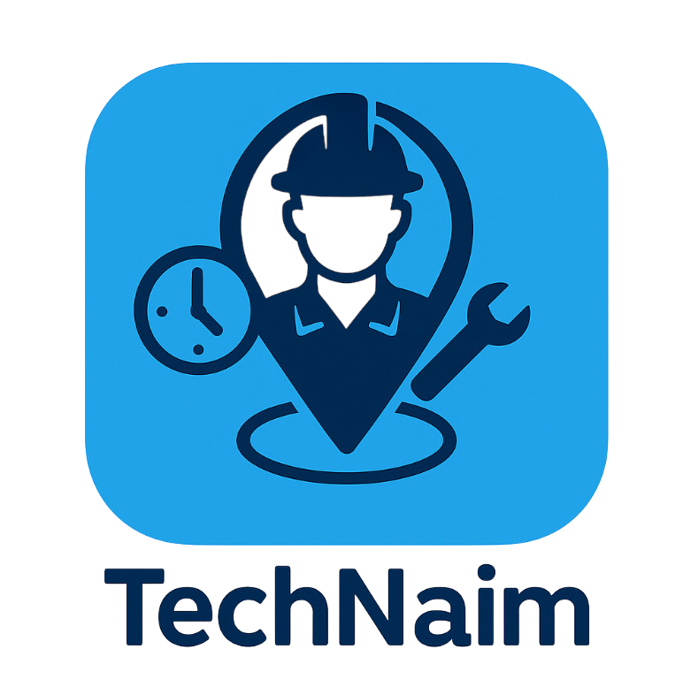
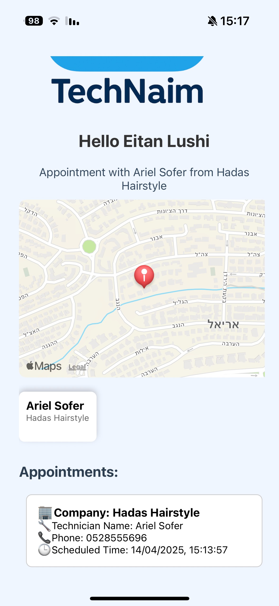
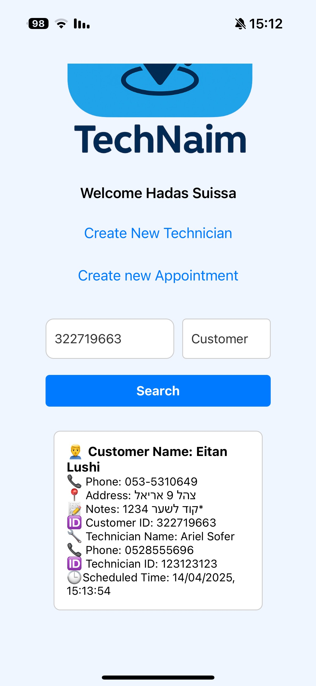
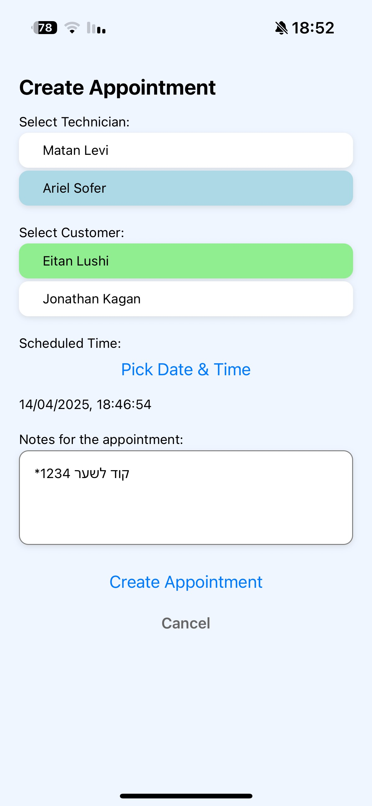

# TechNaim

TechNaim is a full-stack application that connects customers, technicians, and administrators to manage appointments and location sharing seamlessly. Designed for the market, TechNaim helps technicians share their real-time location during in-progress appointments, allowing customers to view their technician’s location on a map.

## Overview

TechNaim integrates a Node.js/Express backend with a React Native frontend. It features real-time updates via Socket.IO and dynamic schedule recalculations when appointments are in progress. The application supports role-specific dashboards:

- **Administrators:** Manage users, appointments, and review overall system status.
- **Technicians:** View daily appointments, update and share real-time location every 10 minutes during in-progress appointments, and automatically recalculate schedules.
- **Customers:** Receive real-time location updates on a map when they have an in-progress appointment and can see estimated technician arrival times.

## Features

- **Real-Time Location Sharing:**  
  - Technicians share their location at 10-minute intervals during in-progress appointments.
  - Customers see an interactive map displaying their technician’s current location.
  
- **Dynamic Schedule Recalculation:**  
  - Schedules are recalculated based on the technician’s current location if the appointment is today (after 8:00 AM).
  - For future appointments, the schedule recalculation uses the technician’s stored address coordinates and a fixed start time of 8:00 AM.
  
- **Socket.IO Rooms:**  
  - Each technician with an in-progress appointment gets a dedicated room.
  - Customers join these rooms only if they have an active appointment with the technician.
  - The system manages room membership automatically based on appointment status.
  
- **Role-Specific Dashboards:**  
  - **Administrator:** A comprehensive dashboard for managing users and appointments.
  - **Technician:** A dashboard to view today's appointments, update location, and finish tasks.
  - **Customer:** A screen to view appointment details and a live map that shows the technician’s location.

## Logo

<!-- Centered Logo -->

  

## Screenshots

<!-- First row: Technician Dashboard and Customer Map -->

  
  

<!-- Second row: Administrator Dashboard and Create Appointment -->

  
  

## Contributing

Contributions to TechNaim are welcome! If you have improvements or bug fixes to share, please:

1. Fork the repository.
2. Create a new branch for your feature or fix (`git checkout -b feature/YourFeature`).
3. Commit your changes (`git commit -am 'Add new feature'`).
4. Push to your fork and submit a Pull Request.

## License

This project is licensed under the [MIT License](./LICENSE).

---

*For more details and updates on the project, please visit the documentation and contribution guidelines in the repository.*
